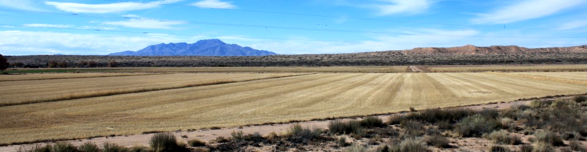

# Ecology and Earth Systems Notebook

This is [my](http://greg.pronghorns.net) set of notes about ecology and earth system science. I use it as a research notebook to document project activities, lab and field procedures, notes on data analysis and statistics, preliminary results, and general info on the nuts and bolts of doing research. Topics here slant towards my reseach interests (biogeochemistry and ecohydrology) and pages are not very organized or well-written. I've posted it nevertheless so others might derive some value from it.

**Cautionary note:** All data, code, figures, results, and discussions are presented in their raw, preliminary form. They have not been peer reviewed and are provided without guarantee of quality, accuracy, or safety. Feel free to contact me with questions and to suggest changes or additions.

## Navigation

The best place to start is the **[Complete topic index](topicindex.md)**

## Copyright information

All site content, unless otherwise noted and including sourcefiles at [my GitHub account](http://github.com/gremau/EarthSciNotebook), is licensed under the [CC Attribution Share Alike](http://creativecommons.org/licenses/by-sa/4.0) (CC-BY-SA) license 4.0.

Unless otherwise noted, software and source code at [my GitHub account](http://github.com/gremau/) that these pages link to is copyrighted 2007-2017 (c) *[Greg Maurer](mailto:greg@pronghorns.net)* and is licensed under the [Apache License, version 2.0](http://www.apache.org/licenses/LICENSE-2.0). You may not use these files except in compliance with this license.
